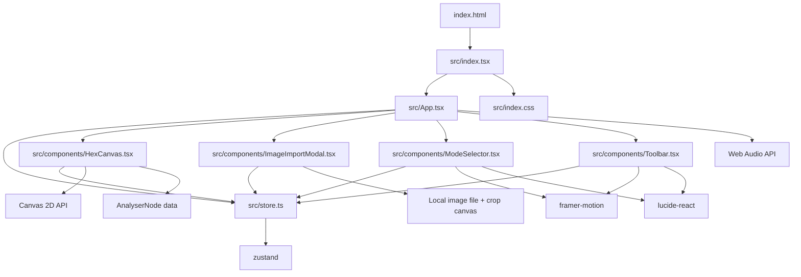
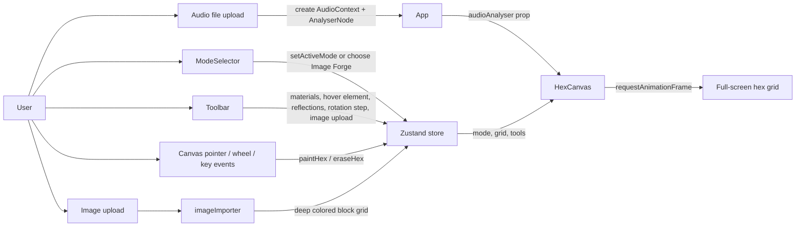
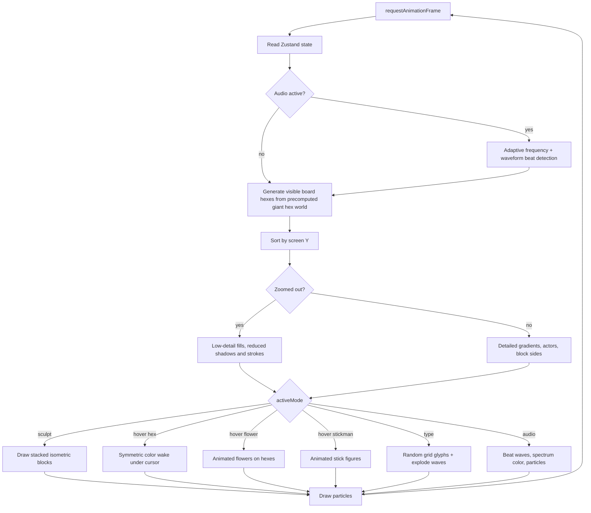
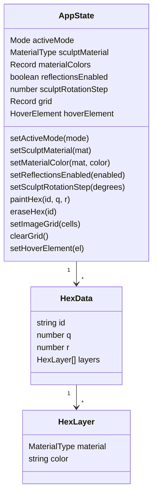
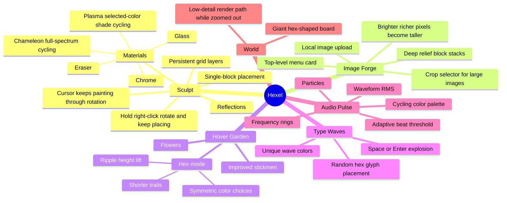

# Hexel Codebase Graph

This graph reflects the current Hexel project: a Vite + React + TypeScript creative canvas app powered by Zustand and a single full-screen 2D render engine.

## Module Dependency Graph

## Runtime Flow

## HexCanvas Engine

## Store Data Model

## Feature Mindmap

